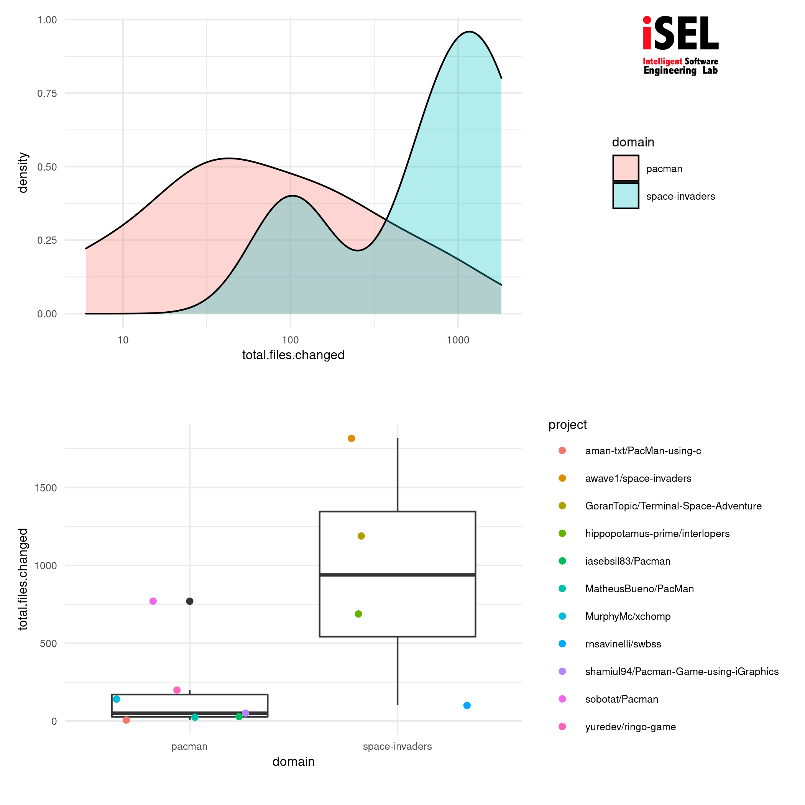
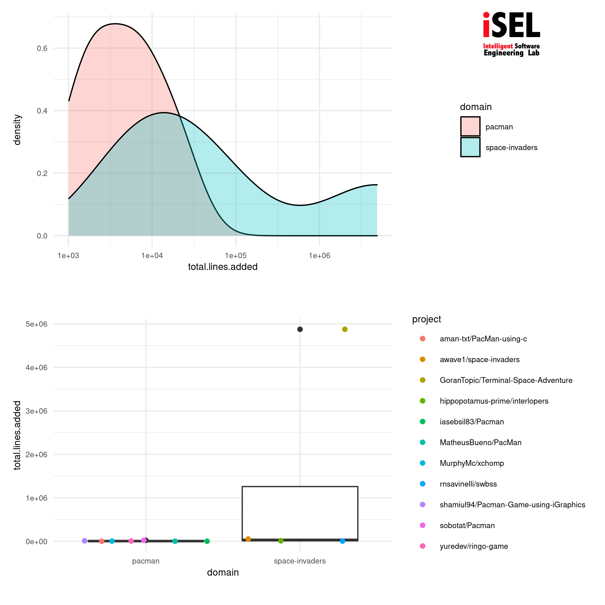
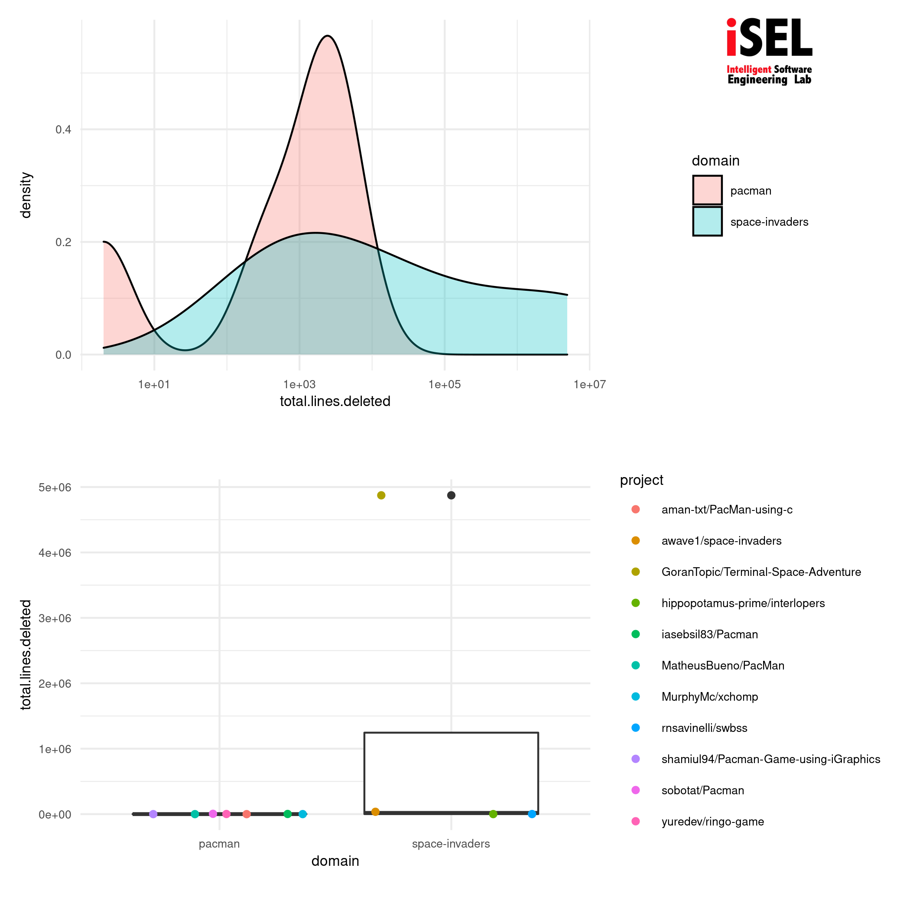
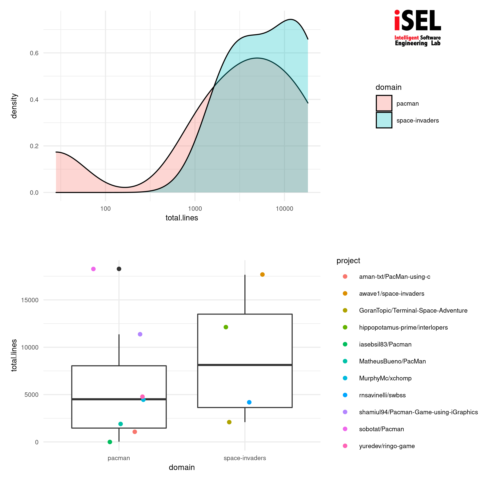

--- 
title: "On Automating Github Topic-based Data Analysis" 
subtitle: "PGC303E Análise de Dados Aplicada - Prof. Marcelo de Almeida Maia"
author: "Students: Mohamed A. Fouad, Antonio Livio Cruz de Mendonca"
abstract: "Github offers an API for searching popular *topics* based on its opensource projects classifications. We adopt a notion of a software domain as the interesection between a number of github topics. We question the effectiveness of automating github's topic-based data analysis via a toolkit of small-in-size software utilities in accordance with the unix philopshy, that provide summary statistics regarding software domains. We report our developement progress of the required utilities as well as our preliminary results, showcasing an exemplary topic-based analysis." 

keywords: "statistical analysis, machine learning, software engineering"
classoption:
- onecolumn
#- twocolumn
output: 
    pdf_document:
     citation_package: natbib
     keep_tex: true
     fig_caption: true
     latex_engine: pdflatex
     number_sections: false 
    geometry: [top=0in, bottom=0in, right=0in, left=0in]
    date: "`r format(Sys.time(), '%B %d, %Y')`"
    fontsize: 8pt
    fontfamily: Times New Roman
---
# Introduction 
Github offers an API for searching popular *topics* based on its opensource projects classifications, e.g. *https://api.github.com/search/repositories?q=topic:game+topic:go* for searching projects under the joint intersection of the topics game and and go. We question the effectiveness of automating github's topic-based data analysis via a toolkit of small-in-size software utilities in accordance with the unix philopshy, for providing summary statistics regarding software domains. We report our developement progress of the required utilities as well as our preliminary results, showcasing an exemplary topic-based analysis. 

We adopt a notion of a software domain as the interesection between a number of github topics and consider summary statistics of such topics and as an example consider the topics "spaceinvaders, game, c" and "pacman, game, c". 

# Toolkit Development 
We report our developement of three utilities that are managed via a Makefile.

## domain(1)
A utility  for searching github according to a list of topics that constitute a software domain and download a selection of the finding for further investigation locally.  

```{shell}
domain $domain_name $topicA $topicB $topicC
```

## stats(1)
A utility for summary statistics of local git repositories, it accepts a directory of git repositories and the produce a csv.  

```{shell}
stats $git_repos_dir
```

## plot(1)
A utility for plotting stats(1) csv.  

```{shell}
plot $csv_fullpath
```
Full sourcecode is available at *[github.com/moresearch/PGC303E](https://github.com/moresearch/PGC303E.git)*

\newpage

# Data Sample

```{r echo = FALSE, results='asis', warning=FALSE, message=FALSE}
#knitr::opts_chunk$set(warning = FALSE, message = FALSE) 
#```{r echo = FALSE}
#install.packages(c("pander"), repos = "http://cran.us.r-project.org")

setwd(".")
library(tidyverse)
library(knitr) 
library(magrittr)
library(kableExtra)
data<-read.csv("DATA/all.csv")
#data <- tibble::rowid_to_column(data, "index")

#data %>% 
#kbl(booktabs = T) %>%
#kable_styling(latex_options = "striped")


#kable(data, "latex") %>%
#  column_spec(1, width = "10em")


pander::pander(data)

#kable('pdf', digits = 2) %>%
#  column_spec(1, bold = T, width = "2600em") %>% 
#  kable_styling(bootstrap_options = c("striped", "hover")) %>%
#  scroll_box(width = "2000px")

#kable(data,)
#kable(data, caption="A table")
#country <- read.table("DATA/all.csv")
#country
```
\newpage

# Visualization

```{r eval=FALSE}
# generate a boxplot
boxplot <- function(input){
	newdata<-arrange(data, !!sym(input)) 
	plot<- newdata%>%
		ggplot(aes(domain, !!sym(input)))+
		geom_boxplot()+ 
		labs(title = "",subtitle = "", caption = "", x = "domain",y = input) +
			theme_minimal() +
			theme(text=element_text(size = 8))+
			geom_jitter(aes(color=project)) 
}

# generate a density plot
denplot <- function(input){
	newdata<-arrange(data, !!sym(input)) 
	plot <- newdata%>%
		ggplot(aes(x=!!sym(input), fill=domain)) +
		geom_density(alpha=0.3)+
		scale_x_log10()+
		theme_minimal() +
		theme(text=element_text(size = 8)) 
}

# Generate a single plot
plotpage <- function(input){
	path<- paste("FIG/",input,".png",sep="")
	ggsave(filename=path, 
		   plot=(denplot(input) / boxplot(input)), 
		   device = png, 
		   units = "mm")
	plot_with_logo <- add_logo(
							   plot_path = path, 
							   logo_path = "FIG/logo.jpg", 
							   logo_position = "top right", 
							   logo_scale = 10 
	)
	magick::image_write(plot_with_logo, path)
}

plotpage("total.files.changed") 
plotpage("total.lines.added") 
plotpage("total.lines.deleted") 
plotpage("total.lines") 

```

## Total Files Changed

\newpage

## Total Lines Added 

\newpage

## Total Lines Deleted 

\newpage

## Total Lines 

\newpage


# Future work
Further development of toolkit as more usecases arise.

# Bibliography
- https://linearb.io/blog/git-statistics
- https://gitential.com/
